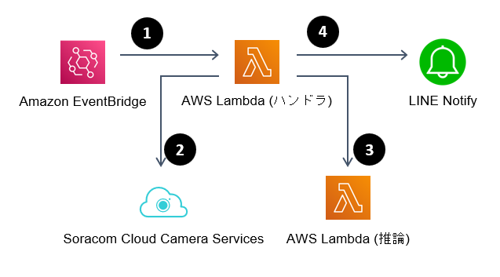

# Door key open detection App with Soracom Cloud Camera Service

Soracom Cloud Camera Service (ソラカメ) の画像を SORACOM API で取得し、Lobe で作成したモデルでドアの鍵の開閉を推論し、結果を LINE Notify で通知するアプリケーションです。AWS Serverless Application Model (SAM) テンプレートを用いてデプロイできます。

**デフォルトで 1 時間ごとに実行されるので注意してください。**

## 構成

1. Amazon EventBridge で定期的に AWS Lambda を呼び出す
2. ソラカメ API で静止画像をエクスポート
3. 静止画像を別の AWS Lambda で推論
4. 推論した結果を LINE Notify で通知

## 利用手順

以下の手順で利用できます。

### 事前準備

アカウントや環境を準備してください。

1. [Soracom Cloud Camera Service](https://soracom.jp/sora_cam/) 対応のカメラを用意する (API の利用にはライセンスの契約も必要です)
2. [LINE Notify](https://notify-bot.line.me/ja/) をセットアップする
3. [AWS](https://aws.amazon.com/jp/?nc2=h_lg) アカウントを用意する
4. [SORACOM SAM ユーザー](https://users.soracom.io/ja-jp/docs/sam/) の認証情報 (認証キー ID、認証キー) を準備する
5. [AWS Serverless Application Model](https://aws.amazon.com/jp/serverless/sam/) (SAM) をセットアップする
   - この手順においては、SAM の利用にあたって Docker の準備も合わせて必要です。

### モデルの準備

[Lobe](https://www.lobe.ai/) を用いてモデルを作成してください。Label は "open" と "closed" を指定してください。モデルは Tensorflow または Tensorflow Lite 形式でエクスポートしてください。このアプリケーションではどちらも利用できますが、以下のような特徴があります。

| モデル | ビルド時間 | Lambda での実行時間 | Lambda の消費メモリ |
--- | --- | --- | ---
| Tensorflow | やや長い (Docker のため) | 最大数十秒 | 多い (デフォルトで 1GB 割り当てています) |
| Tensorflow lite | 非常に長い (glibc をビルドしているため) | 最大数秒 | 少ない (デフォルトで 256MB 割り当てています) |

エクスポートしたファイルは以下のように配置してください。

- Tensorflow
   - saved_model.pb: `door-key-open-detection-with-tf/app/` 配下
   - signature.json: `door-key-open-detection-with-tf/app/` 配下
   - variables: `door-key-open-detection-with-tf/app/variables/` 配下 (variables ディレクトリをもう一つ作ります)
- Tensorflow lite
   - saved_model.tflite: `door-key-open-detection-with-tflite/app/` 配下
   - signature.json: `door-key-open-detection-with-tflite/app/` 配下

### アプリケーションのデプロイ

1. `door-key-open-detection-with-tf` または `door-key-open-detection-with-tflite` をビルド・デプロイします
   - `sam build` `sam deploy --guided` を用います
2. デプロイが完了したら ARN を控えます
3. `door-key-open-detection-handler` のデプロイのため、必要な環境変数を準備します。
   - soracomAuthKeyId: SORACOM SAM ユーザーの認証キー ID
   - soracomAuthKey: SORACOM SAM ユーザーの認証キー
   - deviceId: ソラカメ対応カメラのデバイス ID
   - inferenceLambdaArn: 先ほど控えた推論用 Lambda の ARN
   - lineNotifyToken: LINE Notify のトークン
4. `door-key-open-detection-handler` をビルド・デプロイします
   - `sam build` `sam deploy --guided` を用います

### アプリケーションの削除

SAM でデプロイしたアプリケーションは CloudFormation から削除できます。